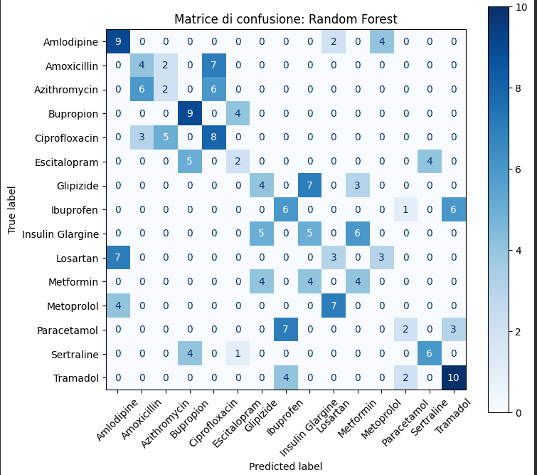

# adabi-portfolio-project-ML_Farmaci
title: "adabi-portfolio-project-ML_Farmaci"
author: "ADABI Group 3 BBF"
date: "2026-07-19"
output: html_document
Portfolio page: https://robertobarbante.github.io
---

```{r setup, include=FALSE}
knitr::opts_chunk$set(echo = TRUE)
```

## R Markdown

This is an R Markdown document. Markdown is a simple formatting syntax for authoring HTML, PDF, and MS Word documents. For more details on using R Markdown see <http://rmarkdown.rstudio.com>.

## Project Overview

Obiettivo del nostro progetto è stato quello di realizzare un modello predittivo di classificazione multiclasse per stimare il farmaco prescritto ad un paziente (Drug _name) utilizzando le variabili note prima della prescrizione quali age, gender e condition.
Nel progetto iniziale il target era Condition e tra le feature era presente Drug_Name.
Nel dataset, però, ogni farmaco (Drug_Name)è associato a una sola condizione clinica (Condition).
Il modello avrebbe potuto ricostruire la condizione direttamente dal nome del farmaco, ottenendo risultati perfetti ma con una situazione di data leakage implicito.
E' stata quindi invertita la domanda ovvero il modello deve distinguere tra i farmaci possibili all'interno della stessa condizione, permettendo un confronto migliore tra modelli.


## Dataset 

 0   Patient_ID               1000 non-null   object 
 1   Age                      1000 non-null   int64  
 2   Gender                   1000 non-null   object 
 3   Condition                1000 non-null   object 
 4   Drug_Name                1000 non-null   object 
 5   Dosage_mg                1000 non-null   int64  
 6   Treatment_Duration_days  1000 non-null   int64  
 7   Side_Effects             1000 non-null   object 
  8   Improvement_Score       1000 non-null   float64
dtypes: float64(1), int64(3), object(5)   

Selezioniamo:

target y variabile dipendente: Drug_Name;
feature X variabile indipendente: Age, Gender e Condition.
Patient_ID viene eliminato perché è soltanto un identificativo.

Non utilizziamo:

Dosage_mg;
Treatment_Duration_days;
Side_Effects;
Improvement_Score.

Queste informazioni sarebbero disponibili dopo la scelta o la somministrazione del trattamento e potrebbero introdurre data leakage rispetto alla domanda: "quale farmaco viene associato al paziente a seconda della sua condizione clinica?"

## Workflow

01_Controllo iniziale
Questa fase serve a capire la struttura generale del dataset.
Controlliamo il  file per individuare colonne, tipi di dati e duplicati.

02_Train/Test split
80% training set e 20% test set con stratificazione cioè si pone la stessa proporzione di ciascuna delle 15 classi di Drug_Name sia nel training set che nel test set.
03_EDA sul training set_Exploratory Data Analysis _ l'analisi Esplorativa dei Dati serve a capire distribuzioni, classi sbilanciate e possibili anomalie (outlier)

04_ Preprocessing
Imputing: Il dataset contiene feature numeriche e categoriche.
Nel dataset iniziale non ci sono valori mancanti per le feature numeriche quindi non dobbiamo sostituirli con la mediana e applicare la standardizzazione.
Per le feature categoriche applichiamo il column transformer One-hot encoding ,cioè convertiamo le variabili qualitative in un formato numerico  binario.
Scaling: cambiamo la scala numerica con cui vengono forniti al modello i valori.
Le colonne numeriche possono avere ordini di grandezza molto diversi percui trasformiamo ogni colonna numerica sottraendo la media e dividendo per la deviazione standard
Dopo la standardizzazione, le feature numeriche sono più direttamente confrontabili, infatti per ognuna vale: media ≈ 0 deviazione standard ≈ 1.

5_ Baseline
Prima di valutare modelli più complessi, costruiamo una Baseline con  classificatore DummyClassifier con strategy  “most frequent”.
Con la Baseline non cerchiamo pattern nelle feature.
Vogliamo la previsione del farmaco più comune nel training set per ogni paziente.
Serve come base di riferimento: se un modello come Logistic Regression, Decision Tree o Random Forest non fa meglio di così, vuol dire che non sta imparando nulla dai dati ma sta solo indovinando la classe maggioritaria.

6_Cross-validation
Confrontiamo i tre modelli trattati e usiamo una cross-validation stratificata a 5 fold sul training set
Valutiamo il modello più volte su parti diverse del training set e calcoliamo l’errore medio e deviazione standard sui 5 split.

7_ Tuning iperparametri
Un albero senza limiti può imparare quasi a memoria il training set.
Si regolano quindi alcuni iperparametri: profondità massima, numero minimo di osservazioni in una "foglia".
Utilizziamo GridSearchCV come tecnica di ottimizzazione degli iperparametri, fornita dalla libreria Python scikit-learn; risulta utile per trovare automaticamente la combinazione ideale di iperparametri del modello ed esegue i test usando soltanto il training set.

08_Valutazione finale
Scegliamo automaticamente il modello con il miglior accuracy F1 score ottenuto durante il tuning.
Soltanto ora lo valutiamo sul test set, che non è stato usato nel training set.
Valutiamo l’accuracy, F1 Score e matrice di confusione del modello Random Forest.

## Models Used
Logistic Regression, Decision Tree o Random Forest

## Results
Metriche principali e grafici.

Modello	Accuracy media	Dev. std. accuracy	F1 macro medio
0	Decision Tree	0.314	0.037	0.299
1	Random Forest	0.308	0.027	0.295
2	Logistic Regression	0.332	0.038	0.246

Il dato più interessante è che il ranking si inverte a seconda della metrica: Logistic Regression vince sull'accuracy ma è ultima sull'F1 macro; Decision Tree è prima sull'F1 macro; Random Forest è il modello con accuracy più bassa. Questo è coerente con quanto avevamo trovato prima: un modello lineare come Logistic Regression tende a "appiattirsi" di più sulla classe più frequente all'interno di ogni condizione (comportamento simile alla baseline che avevamo calcolato, che otteneva accuracy alta ma F1 macro bassissimo), mentre gli alberi riescono a catturare meglio i confini più irregolari tra i 3 farmaci di ogni condizione usando soglie su Age, migliorando il recall sulle classi minoritarie a scapito di qualche punto di accuracy.

## Key Insights
La Random Forest ottimizzata ha ottenuto il miglior risultato, con un F1 macro medio di circa 0,306.
Rispetto alla baseline DummyClassifier (F1 macro ≈ 0,01), il miglior modello migliora di circa 0,30 punti.
Rispetto alla baseline informata basata solo su Condition, il miglioramento è invece limitato, perché la condizione clinica è già molto informativa per prevedere il farmaco.
La variabilità è contenuta: la deviazione standard dell'accuracy è compresa tra circa 0,03 e 0,04, quindi i risultati sono abbastanza stabili.
Gli errori avvengono soprattutto tra farmaci usati per la stessa condizione clinica, perché hanno caratteristiche molto simili nelle feature disponibili.
Ad esempio Metoprolol non viene mai riconosciuto correttamente nel test.
Probabilmente perché le feature disponibili (età, genere e condizione) non sono sufficienti a distinguerlo da altri farmaci della stessa categoria.
Il tuning migliora davvero il Decision Tree e la Random Forest ma il miglioramento è modesto.
Il tuning aumenta leggermente il F1 macro e permette di ottenere modelli un po' più efficaci. Condition, mentre Age e Gender hanno un impatto molto inferiore sulla previsione del farmaco.
Insights dell' approfondimento: riconoscimento di Ibuprofen (Parte II)
Il modello riconosce meglio Ibuprofen isolando il problema rispetto al task multiclasse completo.
Nel task binario il modello riesce a identificare molti casi di Ibuprofen (recall ≈ 77%), mentre nel task multiclasse non lo prevedeva mai correttamente.
La ROC AUC è 0,58. 
È solo leggermente migliore del caso casuale (0,50): il modello distingue Ibuprofen meglio del task principale, ma la capacità discriminante resta limitata.
class_weight="balanced" ha fatto la differenza nel tuning.
È stato scelto come miglior parametro sia per il Decision Tree sia per la Random Forest, perché ha migliorato il riconoscimento della classe minoritaria (Ibuprofen), aumentando il recall e l'F1.
E' stato trovato un compromesso che emerge tra precision e recall imponendo un recall almeno pari all'80%.
Per ottenere un recall dell'84,6%, la precision scende al 35,5%.
Quindi il modello trova quasi tutti i casi di Ibuprofen, ma produce anche molti falsi positivi.
Questo approfondimento aiuta a spiegare perché, nel task principale, Ibuprofen non veniva mai previsto correttamente.
Anche isolando il problema, il modello fatica a distinguere Ibuprofen dagli altri farmaci.
Nel task multiclasse questa difficoltà aumenta ulteriormente, portando il modello a non prevedere mai correttamente la classe Ibuprofen.

